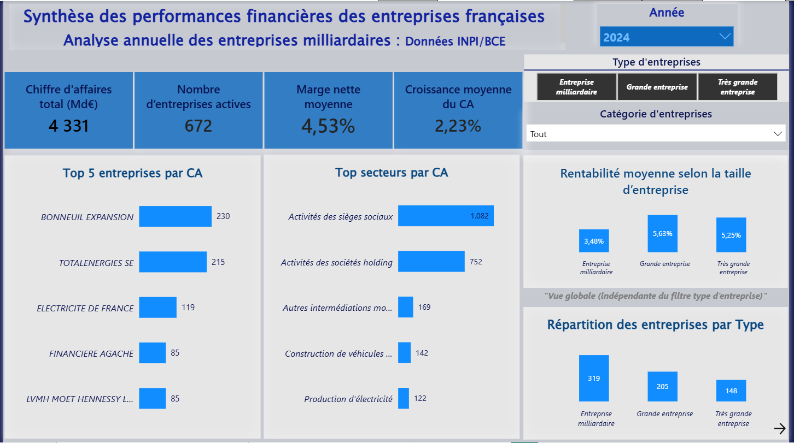
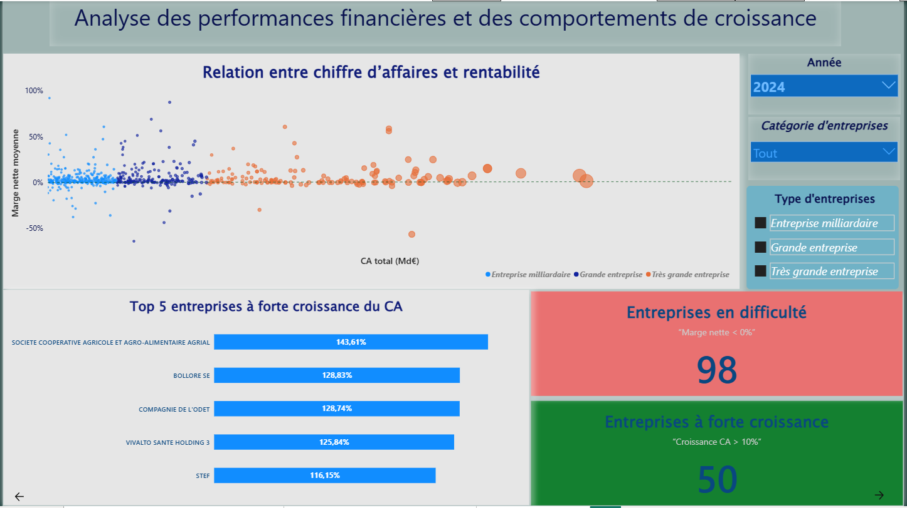
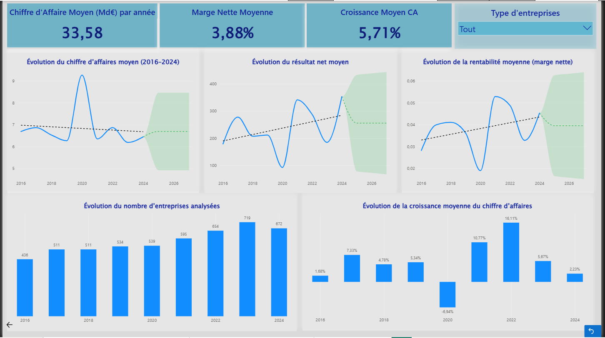

# 📊 Analyse des entreprises milliardaires françaises  
## Pipeline analytique avec DuckDB, dbt et Power BI


---

# 📌 Présentation du projet

Ce projet de Data Analysis vise à analyser les performances financières des entreprises françaises milliardaires à partir des données ouvertes BCE / INPI.

L’objectif est de construire un pipeline analytique complet permettant :
- le nettoyage des données financières ;
- l’enrichissement des entreprises via la base SIRENE ;
- la modélisation analytique avec dbt ;
- l’export des tables optimisées pour Power BI ;
- la création d’un dashboard interactif orienté Business Intelligence.

---

# 🏗️ Architecture du projet

```text
Données BCE/INPI
        ↓
DuckDB (nettoyage & transformations)
        ↓
dbt (staging → marts)
        ↓
Exports CSV optimisés
        ↓
Power BI Dashboard

🛠️ Technologies utilisées
Outil	Utilisation
Python	Nettoyage et transformations
DuckDB	Base analytique locale
dbt	Modélisation des données
Power BI	Visualisation interactive
SQL	Requêtes analytiques
CSV / Parquet	Sources de données

📂 Structure du projet
finance_analysis_dbt_duckdb_powerbi/
│
├── data/
│   ├── dim_entreprise_enrichie_final.csv
│   ├── dim_temps.csv
│   └── fact_finance_clean_for_bi.csv
│
├── dbt/
│   ├── models/
│   │   ├── staging/
│   │   └── marts/
│   ├── seeds/
│   ├── dbt_project.yml
│   └── packages.yml
│
├── powerbi/
│   └── Finance_Analytics_Dashboard.pbix
│
├── screenshots/
│   ├── Vue_densemble_Synthese.png
│   ├── Analyse_Performances_Financieres.png
│   └── Evolution_Financiere.png
│
├── scripts/
│   ├── 10_enrichissement_left_join.py
│   ├── 12_nettoyage_naf.py
│   └── 14_export_powerbi.py
│
└── README.md
```
---
## 📊 Dashboard Power BI

Le rapport Power BI est structuré autour de 3 pages analytiques :

---

### 1️⃣ Vue d’ensemble des performances financières

Analyse globale :

- chiffre d’affaires total ;
- croissance moyenne ;
- rentabilité moyenne ;
- répartition des entreprises ;
- secteurs les plus générateurs de CA.

#### Aperçu



---

### 2️⃣ Analyse des performances financières

Analyse :

- relation entre chiffre d’affaires et rentabilité ;
- entreprises en difficulté ;
- entreprises à forte croissance ;
- analyse comparative par taille d’entreprise.

#### Aperçu



---

### 3️⃣ Évolution financière

Analyse temporelle :

- évolution du chiffre d’affaires ;
- évolution de la marge nette ;
- évolution du résultat net ;
- évolution du nombre d’entreprises ;
- tendances de croissance.

#### Aperçu



🧠 Principales analyses réalisées
Analyse des entreprises milliardaires françaises
Détection des entreprises à forte croissance
Analyse des entreprises déficitaires
Analyse de rentabilité par taille d’entreprise
Évolution financière entre 2016 et 2024
Analyse sectorielle du chiffre d’affaires
🗃️ Sources des données
📌 Données financières BCE / INPI

Source officielle :

https://data.economie.gouv.fr/explore/dataset/ratios_inpi_bce/

Informations utilisées
Version exploitée : Avril 2026
Dernière mise à jour observée : 20 avril 2026
📌 Enrichissement SIRENE

Source officielle :

https://www.data.gouv.fr/fr/datasets/base-sirene-des-entreprises-et-de-leurs-etablissements-siren-siret/

Informations utilisées
Fichier : StockUniteLegale
Format : parquet
Version exploitée : Avril 2026
⚙️ Pipeline analytique
Étapes principales
1. Nettoyage des données BCE/INPI
sélection des colonnes utiles ;
nettoyage des valeurs ;
gestion des doublons.
2. Enrichissement SIRENE
jointure SIREN ;
enrichissement des entreprises ;
ajout des catégories NAF.
3. Modélisation dbt
staging ;
marts ;
tables analytiques finales.
4. Export Power BI
génération des tables optimisées ;
création du dashboard interactif.
🚀 Compétences démontrées
Data Engineering
DuckDB
dbt
SQL analytique
Modélisation de données
Data Analysis
KPI financiers
Analyse sectorielle
Analyse temporelle
Détection d’anomalies
Business Intelligence
Power BI
Storytelling visuel
Dashboard interactif

## 👤 Auteur

**DJAHA YANKEP Charly William**  
Ingénieur informatique | Data Analyst  
Spécialisé en analyse de données, Business Intelligence et modélisation analytique.


Compétences :
SQL
Python
DuckDB
dbt
Power BI

GitHub :
https://github.com/Djaha-Charly
